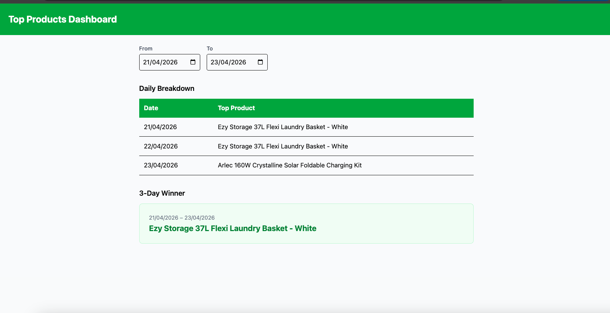
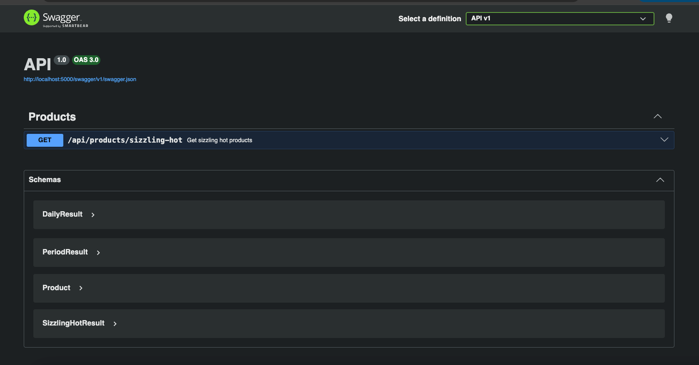

# Bunnings Sizzling Hot Products

A full-stack solution for Bunnings' "Sizzling Hot" feature — surfacing the
most popular product per day and over a configurable date range, based on
order data.

---

## Screenshots

### Frontend



### Swagger API Documentation



---

## Stack

| Layer            | Technology                                  | Reason                                                                                                            |
| ---------------- | ------------------------------------------- | ----------------------------------------------------------------------------------------------------------------- |
| Backend          | ASP.NET Core Minimal API (.NET 8)           | Lightweight entry point suited to a small API surface area                                                        |
| Architecture     | Clean Architecture                          | Decouples business logic from infrastructure; makes the service layer independently testable                      |
| Frontend         | Vite + React 19 + TypeScript + Tailwind CSS | Fast dev experience, type safety, utility-first styling                                                           |
| Testing          | xUnit + FluentAssertions + NSubstitute      | Standard .NET testing stack; FluentAssertions improves test readability, NSubstitute for clean repository mocking |
| Frontend Testing | Vitest + React Testing Library + Playwright | Unit tests for components/hooks/utils, E2E tests for full user flows                                              |
| API Docs         | Swagger (Swashbuckle)                       | Self-documenting API, interactive testing via Swagger UI                                                          |
| Container        | Docker + Docker Compose                     | Consistent environment across machines, single command to run full stack                                          |
| CI/CD            | GitHub Actions                              | Automated backend tests, frontend unit tests, and E2E tests on every push                                         |

---

## Architecture Overview

The backend follows Clean Architecture with four layers:

```
Domain         → Core models (Order, Product). No dependencies.
Application    → Business logic (SizzlingHotService). Depends only on Domain interfaces.
Infrastructure → JSON file repositories. Implements Application interfaces.
API            → Minimal API endpoints. Wires everything together via DI.
```

This means the business rules in `SizzlingHotService` have zero knowledge of
how data is stored or served — swapping JSON files for a database requires
only a new Infrastructure implementation with no changes to the service layer.

---

## Business Rules Implemented

1. A product is counted once per order regardless of quantity
2. Same customer buying the same product on the same day across multiple
   orders counts as one sale
3. A cancelled order (matched by `orderId`) removes that product's sale
   from the original order's date
4. Ties are broken alphabetically — the first product name in the list wins

---

## Assumptions

### Date & Scope

- Today's date is fixed at **23/04/2026** as per the brief
- The default date range is **21/04/2026 – 23/04/2026** inclusive
- The date range is configurable via the frontend date picker or API query params
- Orders outside the queried date range are excluded from calculations but
  still processed for cancellation matching

### Cancellation Behaviour

- A cancelled order is identified by `status: "cancelled"` and matched to
  its original completed order via `orderId`
- The cancellation record itself carries no `entries` — the entries are
  sourced from the original completed order
- If a cancelled `orderId` does not match any completed order, it is safely
  ignored with no effect on results
- If two completed orders share the same `orderId`, both are excluded when
  a cancellation for that `orderId` is encountered (defensive behaviour;
  documented as a data quality issue)

### Product & Order Data

- If a product ID appears in an order but does not exist in `products.json`,
  that entry is silently skipped — it cannot be named or ranked
- If `products.json` or `orders.json` is empty, the API returns an empty
  result set with a 200 OK response (no top product exists)
- If either file is missing or malformed, the API returns a 500 response
  with a descriptive error message
- Orders with an empty `entries` array are valid (e.g. cancelled orders)
  and are handled without errors
- The `date` field in orders uses `dd/MM/yyyy` format — a custom
  `DateOnlyJsonConverter` handles deserialisation from this format

### Results Behaviour

- If all orders for a given day are cancelled, that day returns no top
  product — it is omitted from the daily results
- If all orders across the entire period are cancelled, the period result
  is empty — no top product is returned
- If a date range is queried with no orders at all, an empty result is
  returned rather than an error
- If every product ties on a given day, alphabetical ordering is applied
  across all tied products and the first is selected
- If `from` is after `to`, the API returns 400 Bad Request

---

## Getting Started

### Prerequisites

#### Running Locally

- .NET 8 SDK
- Node.js 20+

#### Running with Docker

- Docker Desktop

---

### Option 1 — Docker (Recommended)

The easiest way to run the full stack with a single command:

```bash
docker compose up --build
```

| Service  | URL                             |
| -------- | ------------------------------- |
| API      | `http://localhost:5000`         |
| Swagger  | `http://localhost:5000/swagger` |
| Frontend | `http://localhost:3000`         |

To stop:

```bash
docker compose down
```

---

### Option 2 — Running Locally

**Backend**

```bash
cd backend
dotnet restore
dotnet run --project src/API
```

API runs at `http://localhost:5000`
Swagger UI at `http://localhost:5000/swagger`

**Frontend**

Copy the environment file and install dependencies:

```bash
cd frontend
cp .env.example .env
npm install
npm run dev
```

Frontend runs at `http://localhost:3000`

---

### Environment Variables

The frontend requires a `.env` file. A sample is provided:

```bash
cp frontend/.env.example frontend/.env
```

| Variable       | Default                 | Description          |
| -------------- | ----------------------- | -------------------- |
| `VITE_API_URL` | `http://localhost:5000` | Backend API base URL |

The backend reads configuration from `appsettings.json`. The CORS allowed
origin can be overridden via the `AllowedOrigins` key in `appsettings.json`
or as an environment variable.

---

## API Endpoints

Full interactive documentation available at `http://localhost:5000/swagger`.

| Method | Endpoint                     | Description                                            |
| ------ | ---------------------------- | ------------------------------------------------------ |
| GET    | `/api/products/sizzling-hot` | Returns daily and period top products for a date range |

### Query Parameters

| Parameter | Default      | Description            |
| --------- | ------------ | ---------------------- |
| `from`    | `2026-04-21` | Start date (inclusive) |
| `to`      | `2026-04-23` | End date (inclusive)   |

### Response Shape

```json
{
  "daily": [
    {
      "date": "2026-04-21",
      "product": {
        "id": "P1",
        "name": "Ezy Storage 37L Flexi Laundry Basket - White"
      }
    }
  ],
  "period": {
    "from": "2026-04-21",
    "to": "2026-04-23",
    "product": {
      "id": "P1",
      "name": "Ezy Storage 37L Flexi Laundry Basket - White"
    }
  }
}
```

---

## Testing

### Backend

Unit tests cover `SizzlingHotService` in isolation using in-memory test
data — no file I/O involved. Repository interfaces are stubbed with
NSubstitute so tests remain fast and deterministic. Integration tests cover
the API endpoint using `WebApplicationFactory`.

```bash
dotnet test
```

**Core business rules**

- Basic top product selection across multiple products
- Quantity is ignored — five units in one order counts as one sale (rule 1)
- Customer deduplication within a day across separate orders (rule 2)
- Cancellation credits the sale back to the original order's date (rule 3)
- Tie-breaking selects the alphabetically first product name (rule 4)

**Edge cases**

- Order with empty entries array is handled without errors
- Cancelled `orderId` with no matching completed order is safely ignored
- All orders for a single day are cancelled — day is omitted from results
- All orders across all days are cancelled — period result is empty
- Product ID in order has no match in products list — entry is skipped
- Empty orders input — returns empty result
- Empty products input — returns empty result
- Every product ties — alphabetical ordering applied correctly

**Integration tests**

- Valid date range returns 200 with correct structure
- Invalid date range (`from` after `to`) returns 400

### Frontend

Unit tests cover components and hooks in isolation using Vitest and React
Testing Library.

```bash
cd frontend && npm test
```

**Components tested:** `DailySizzleTable`, `PeriodSizzleCard`, `DateRangePicker`

**Hooks tested:** `useDateRange` — validation logic and date state management

**Utilities tested:** `formatDate`

### E2E Tests

Playwright E2E tests cover full user flows across Chromium, Firefox and WebKit.

```bash
# Requires backend running at http://localhost:5000
dotnet run --project backend/src/API

cd frontend && npx playwright test
```

**Scenarios:**

- Page loads with correct default results
- Validation error appears when `from` is after `to`
- URL updates when dates change
- Changing dates updates the displayed results

---

## CI/CD

GitHub Actions runs on every push and pull request to `main`:

```
push to main
    ↓
backend-tests ──┐
                ├──→ e2e-tests
frontend-tests ─┘
```

| Job              | What it runs                                      |
| ---------------- | ------------------------------------------------- |
| `backend-tests`  | `dotnet restore` → `dotnet build` → `dotnet test` |
| `frontend-tests` | `npm ci` → `npm test -- --run`                    |
| `e2e-tests`      | Starts backend, runs Playwright across 3 browsers |

---

## Folder Structure

```
sizzling-hot-products/
├── .github/workflows/ci.yml
├── docker-compose.yml
├── docs/screenshots/
├── backend/
│   ├── Dockerfile
│   ├── src/
│   │   ├── API/                  # Minimal API, DI wiring, endpoints, Swagger
│   │   ├── Application/          # Interfaces, SizzlingHotService, models
│   │   ├── Domain/               # Order, OrderEntry, Product, OrderStatus
│   │   └── Infrastructure/       # JSON repositories, DateOnly converter, inputs/
│   └── tests/
│       └── Application.Tests/    # xUnit unit tests, integration tests, builders
└── frontend/
    ├── Dockerfile
    ├── .env.example
    ├── e2e/                      # Playwright E2E tests
    └── src/
        ├── components/           # DailySizzleTable, PeriodSizzleCard, DateRangePicker
        ├── hooks/                # useSizzlingHot, useDateRange
        ├── test/                 # Vitest unit tests
        ├── types/                # API response types
        ├── utils/                # dateFormatter
        └── App.tsx
```

---

## What I'd Improve With More Time

- **Persistent storage** — replace JSON file repositories with a PostgreSQL
  database via EF Core; the repository interfaces make this a straight swap
  with no changes to the service layer
- **Caching** — cache aggregated results with a short TTL since the
  underlying order data changes infrequently; `IMemoryCache` or Redis
  depending on scale. The repository currently reads from disk on every
  request
- **Date flexibility** — make "today" injectable via `TimeProvider` (.NET 8)
  rather than hardcoded, enabling real-time rolling windows and easier
  testing of time-dependent logic
- **TanStack Query** — replace `useEffect` data fetching in the frontend
  with TanStack Query for built-in caching, automatic refetching, and
  better error handling
- **Pagination** — for the daily results when the dataset grows large
- **Authentication** — secure endpoints with JWT bearer tokens if this were
  customer-facing in production
- **Observability** — structured logging via Serilog and error tracking via
  Sentry to monitor failures in production
- **Frontend error boundaries** — graceful UI degradation if the API is
  unavailable, rather than a broken state
- **Format-agnostic repositories** — the current `JsonOptions` is
  infrastructure-scoped and doesn't leak into Application, but a more
  generic file reader could support CSV or XML sources without touching
  the repository interfaces
